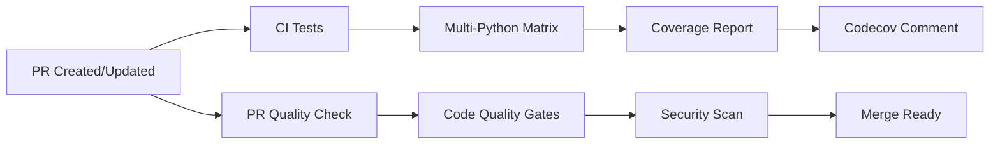
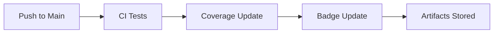

# Continuous Integration and Deployment

This document describes the CI/CD setup for ListenBrainz Local.

## 🚀 **GitHub Actions Workflows**

### 1. **CI Tests** (`ci.yml`)
**Triggers**: Push to `main`/`develop`, Pull Requests
**Purpose**: Core testing pipeline

**Features**:
- ✅ **Multi-Python Testing** (3.9, 3.10, 3.11)
- ✅ **Dependency Caching** for faster builds
- ✅ **Code Linting** with flake8
- ✅ **Test Execution** with coverage reporting
- ✅ **Coverage Upload** to Codecov
- ✅ **PR Coverage Comments** automatic coverage reporting
- ✅ **Test Artifacts** preserved for debugging

**Duration**: ~3-5 minutes per Python version

### 2. **PR Quality Check** (`pr-quality.yml`)
**Triggers**: Pull Requests (non-draft)
**Purpose**: Code quality and standards enforcement

**Features**:
- 🎨 **Code Formatting** check with Black
- 📦 **Import Sorting** check with isort  
- 🔒 **Security Scanning** with Bandit
- 🏷️ **Type Checking** with mypy (advisory)
- 🔍 **Code Quality Checks** (TODOs, print statements, hardcoded secrets)
- 🧪 **Fast Test Suite** for quick feedback
- 📊 **Coverage Requirements** (70% minimum)
- 📚 **Documentation Validation**
- ⚡ **Performance Checks**

**Duration**: ~2-3 minutes

### 3. **Nightly Tests** (`nightly.yml`)
**Triggers**: Daily at 2 AM UTC, Manual dispatch
**Purpose**: Comprehensive testing and maintenance

**Features**:
- 🌙 **Extended Test Suite** with integration tests
- 🗄️ **Database Scenario Testing**
- 📊 **Detailed Reporting** with test summaries
- 🔒 **Security Audits** with Safety and Bandit
- 🚨 **Failure Notifications** via GitHub issues
- 📈 **Performance Monitoring**

**Duration**: ~10-15 minutes

## 🏃‍♂️ **Workflow Execution**

### **On Pull Request**


### **On Push to Main**


## 📊 **Quality Gates**

### **Required Checks for PR Merge**
- ✅ All CI tests pass on all Python versions
- ✅ Code formatting matches Black standards
- ✅ Import sorting matches isort configuration
- ✅ No critical security issues found
- ✅ Test coverage ≥ 70%
- ✅ Framework validation tests pass

### **Advisory Checks**
- 🔍 Type checking with mypy (warnings only)
- 📝 Documentation completeness
- ⚡ Performance regression detection

## 🔧 **Configuration Files**

### **Test Configuration**
- `pytest.ini` - Pytest settings and coverage configuration
- `requirements-test.txt` - Testing dependencies
- `run_tests.py` - Custom test runner with environment setup

### **Code Quality**
- `.github/workflows/` - GitHub Actions workflow definitions
- `Makefile` - Local development commands
- `conftest.py` - Pytest fixtures and test setup

### **Dependencies**
- `.github/dependabot.yml` - Automated dependency updates
- Weekly updates for Python packages
- Monthly updates for GitHub Actions
- Security-focused update grouping

## 🎯 **Local Development Integration**

### **Pre-commit Hooks** (Recommended)
```bash
# Install pre-commit hooks for local development
pip install pre-commit
pre-commit install

# Run manually
pre-commit run --all-files
```

### **Local CI Simulation**
```bash
# Run the same checks that CI runs
make test              # Full test suite
make test-coverage     # With coverage
make lint             # Code linting
make format           # Code formatting
```

## 📈 **Monitoring and Reporting**

### **Coverage Tracking**
- **Codecov Integration**: Automatic coverage reports
- **PR Comments**: Coverage changes highlighted
- **Badge Updates**: README badges reflect current status
- **HTML Reports**: Detailed coverage available in artifacts

### **Test Results**
- **Artifacts**: Test results preserved for 30 days
- **Multiple Formats**: HTML, XML, and terminal reports
- **Failure Analysis**: Detailed logs and timing information

### **Security Monitoring**
- **Dependency Scanning**: Safety checks for known vulnerabilities
- **Code Analysis**: Bandit security linting
- **Regular Audits**: Nightly security scans

## 🚨 **Troubleshooting CI Issues**

### **Common Failures**

1. **Import Errors**
   ```bash
   # Usually missing dependencies
   pip install -r requirements.txt
   pip install -r requirements-test.txt
   ```

2. **Test Database Issues**
   ```bash
   # Clean up test artifacts
   make clean
   ```

3. **Coverage Failures**
   ```bash
   # Check coverage locally
   make test-coverage
   ```

4. **Formatting Issues**
   ```bash
   # Auto-fix formatting
   black lb_local/ tests/
   isort lb_local/ tests/
   ```

### **Debugging Failed Workflows**

1. **Download Artifacts**: Test results and coverage reports
2. **Check Logs**: Full workflow execution logs available
3. **Local Reproduction**: Use same Python version and commands
4. **Environment Issues**: Check for OS-specific problems

### **Workflow Status**

| Workflow | Status | Purpose | Frequency |
|----------|--------|---------|-----------|
| CI Tests |  | Core testing | Every PR/Push |
| PR Quality |  | Code standards | Every PR |
| Nightly |  | Comprehensive | Daily |

## 🔄 **Release Process**

### **Automated**
1. **Dependency Updates**: Dependabot creates PRs weekly
2. **Security Updates**: Immediate notifications for vulnerabilities
3. **Badge Updates**: README badges automatically reflect status

### **Manual**
1. **Feature Branches**: Create from `main` or `develop`
2. **Pull Requests**: Automated testing and review
3. **Merge**: Automated deployment triggers (if configured)

## 📚 **Resources**

- [GitHub Actions Documentation](https://docs.github.com/en/actions)
- [Codecov Documentation](https://docs.codecov.com/)
- [Testing Documentation](TESTING.md)
- [Contributing Guidelines](README.md#contributing)

## 🆘 **Getting Help**

If you encounter CI/CD issues:

1. **Check Workflow Logs**: Detailed execution information
2. **Review Test Results**: Download artifacts for analysis
3. **Local Testing**: Reproduce issues locally
4. **Create Issue**: Use the test failure issue template
5. **Ask for Help**: Tag maintainers in PR comments
